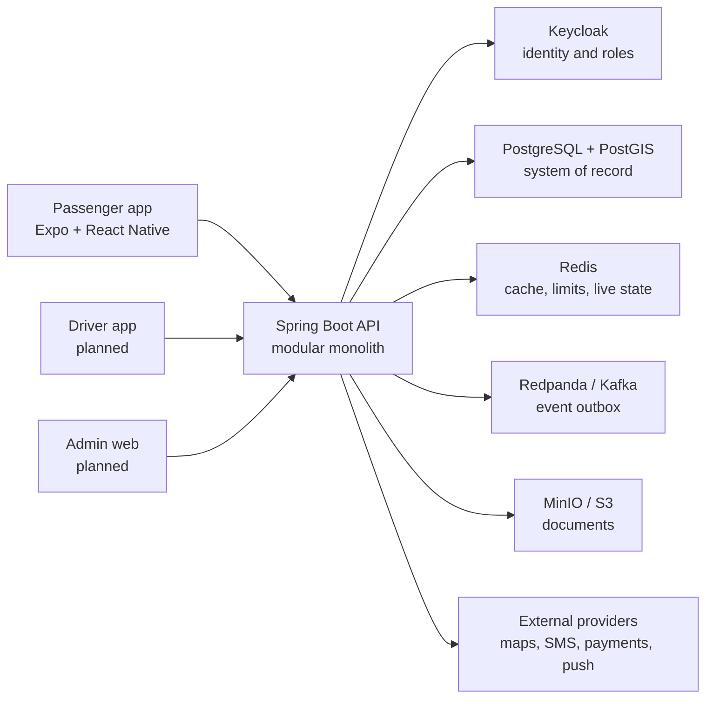

# RouteShareApp

RouteShareApp is a route-based ride-sharing platform for Sri Lanka. Instead of dispatching a driver on demand, it lets drivers publish journeys they already plan to make and allows passengers to book seats for full or partially overlapping route segments.

The repository contains a production-oriented Spring Boot backend, the active Expo passenger application, shared API contracts, local infrastructure, and the planned workspaces for driver and admin clients.

> **Project status:** the backend domain and provider-adapter work is implemented and verified. The passenger app currently covers onboarding through ride discovery and ride detail; booking and the later trip lifecycle screens are still in progress. The driver app and admin web client have not been implemented yet. See [Development status](docs/development/DEVELOPMENT_STATUS.md) for the latest evidence and [Implementation roadmap](docs/development/IMPLEMENTATION_ROADMAP.md) for remaining work.

## What the platform supports

The backend models the complete RouteShare workflow:

- Passenger and driver identity with Keycloak, JWT roles, and phone OTP support
- Passenger profiles, saved places, trusted contacts, avatars, and verification documents
- Driver applications, KYC documents, vehicles, verification, and payout profiles
- One-time and recurring route publication with concrete route occurrences
- PostGIS-based full and partial route-overlap search, ranking, and seat availability
- Booking idempotency, approval, cancellation, state history, and transactional seat inventory
- Trip lifecycle, live location, passenger boarding/drop-off, early exit, and trip sharing
- Fare estimation and finalization, cash/card payment flows, commission, settlements, and payouts
- Notifications, ratings, support tickets, SOS events, admin operations, audit logs, and reports
- Gated integrations for Google Maps, Notify.lk, Cybersource, Firebase, S3-compatible storage, Kafka, and Sentry

The passenger mobile app currently has real screens for splash/onboarding, login and OTP, profile setup, home, ride search, search results, ride detail, account, saved places, trusted contacts, and verification. Routes after ride detail are registered but currently fall back to placeholder UI.

## Architecture



The API is a modular monolith organized by business domain. Modules communicate through service and facade boundaries, use one PostgreSQL database with schema-per-module isolation, and are protected by architecture tests. Flyway owns forward-only database migrations.

Key runtime choices:

| Area | Technology |
| --- | --- |
| Backend | Java 21, Spring Boot 3.3, Spring Security, JPA, WebSocket |
| Mobile | Expo 56, React Native, TypeScript, React Navigation |
| Data | PostgreSQL 16, PostGIS, Flyway |
| Identity | Keycloak 25, OAuth 2.0/OIDC, JWT, PKCE |
| Runtime support | Redis, Redpanda/Kafka, MinIO |
| Contracts | OpenAPI 3.1 and a shared TypeScript endpoint inventory |
| QA | JUnit, Testcontainers, Vitest, Maestro, JaCoCo, Spotless |

For the detailed design, see [RouteShareApp architecture](docs/architecture/RouteShareApp_ARCHITECTURE.md) and [backend module rules](docs/architecture/BACKEND-MODULAR-MONOLITH-SERVICE-IMPL-FACADE.md).

## Repository layout

```text
route-share/
├── apps/
│   ├── api/                    # Implemented Spring Boot modular monolith
│   ├── passenger-mobile/       # Active Expo React Native passenger app
│   ├── driver-mobile/          # Planned driver client placeholder
│   └── admin-web/              # Planned admin client placeholder
├── packages/
│   ├── api-contracts/          # Shared TypeScript API endpoint inventory
│   └── shared-types/           # Reserved shared-types workspace
├── infra/
│   ├── docker-compose/         # Local services and production API overlay
│   └── keycloak/               # Importable RouteShare realm configuration
├── docs/
│   ├── api/                    # Passenger, driver, and admin OpenAPI contracts
│   ├── architecture/           # System and backend architecture
│   ├── database/               # Database architecture and diagrams
│   └── development/            # Status, roadmap, decisions, tasks, and runbooks
├── qa/
│   ├── maestro/                # Executable passenger mobile flows
│   └── test-cases/             # Task-mapped QA specifications
└── scripts/                    # Local environment, QA, and simulation helpers
```

Generated QA evidence is intentionally ignored under `qa/reports/`; durable results are summarized in the development tracking documents.

## Prerequisites

Install the following before starting local development:

- Docker Desktop with Docker Compose
- Java 21
- Node.js 20 or newer
- pnpm 10.33.2 (`corepack enable` is the easiest setup)
- Android Studio, an Android emulator, `adb`, and Maestro for device QA

iOS development additionally requires macOS and Xcode. The backend can be developed without the mobile toolchain.

## Local quick start

### 1. Install JavaScript dependencies

From the repository root:

```bash
corepack enable
pnpm install
```

### 2. Configure the environment

```bash
cp .env.example .env
```

The committed template uses local-safe values and keeps all external providers disabled. Put real credentials only in the ignored `.env` file or a secret manager; never commit them.

For local OTP QA without sending an SMS, set `NOTIFY_LK_ALLOW_DEMO_SENDER_FOR_OTP=true` only in your local environment. This enables the backend-only demo code documented in [QA guidance](qa/README.md); the mobile app does not contain an OTP bypass.

### 3. Start local infrastructure

```bash
./scripts/dev-up.sh
```

This starts:

| Service | Local address | Purpose |
| --- | --- | --- |
| PostgreSQL/PostGIS | `localhost:5433` | Primary database and route geometry |
| Redis | `localhost:6379` | Caching, rate limits, and live state |
| Redpanda/Kafka | `localhost:9092` | Event-outbox delivery |
| Keycloak | `http://localhost:8081` | Identity, roles, and tokens |
| MinIO API | `http://localhost:9000` | Local S3-compatible storage |
| MinIO console | `http://localhost:9001` | Local storage administration |

Useful infrastructure commands:

```bash
./scripts/dev-logs.sh
./scripts/dev-down.sh
```

### 4. Run the API

The Compose stack exposes PostgreSQL on port `5433`, so pass the matching JDBC settings when running Spring Boot directly:

```bash
cd apps/api
ROUTESHARE_JDBC_URL=jdbc:postgresql://localhost:5433/routeshare \
ROUTESHARE_DB_USER=routeshare \
ROUTESHARE_DB_PASSWORD=change-me-local-only \
./mvnw spring-boot:run
```

If you changed the database values in `.env`, use the same values here.

Verify the API:

```bash
curl http://localhost:8080/actuator/health
```

Developer endpoints:

- Swagger UI: `http://localhost:8080/swagger-ui.html`
- OpenAPI JSON: `http://localhost:8080/api-docs`
- Health: `http://localhost:8080/actuator/health`

Flyway applies migrations automatically when the API starts.

### 5. Run the passenger app

For an already-installed Expo development client, start Metro on the repository's Android development port:

```bash
pnpm --filter @routeshare/passenger-mobile start:android:local
```

For a connected Android emulator, the project wrapper builds/installs the development app, configures port forwarding, and runs a Maestro flow:

```bash
./scripts/qa-check-tools.sh
./scripts/qa-passenger-dev-run.sh
```

The emulator flow expects the API on port `8080`, Metro on `8082`, and normally uses `emulator-5554`. Native configuration changes, including Google Maps keys, require rebuilding the development client.

See [Passenger app notes](apps/passenger-mobile/README.md) for environment profiles and [RouteShare QA](qa/README.md) for device setup and executable flows.

## Configuration and external services

All paid or production-sensitive providers are capability-gated. The application starts with safe fallbacks or fail-closed behavior when they are disabled.

| Integration | Enable with | Disabled behavior |
| --- | --- | --- |
| Google Maps/Places | `GOOGLE_MAPS_ENABLED=true` plus server and platform keys | Approximate distance fallback; production map/search is unavailable |
| Notify.lk SMS | `NOTIFY_LK_ENABLED=true` plus approved credentials | Real OTP delivery is unavailable |
| Cybersource cards | `CYBERSOURCE_ENABLED=true` plus merchant credentials | Cash remains available; card operations fail closed |
| Firebase push | `PUSH_NOTIFICATIONS_ENABLED=true` plus service account/client config | Notifications persist without push delivery |
| Object storage | `OBJECT_STORAGE_ENABLED=true` plus S3/MinIO credentials | Document upload/download fails closed |
| Kafka delivery | `ROUTESHARE_EVENTS_KAFKA_ENABLED=true` | The transactional outbox drains to logs |
| Sentry | Set the relevant Sentry DSN | Error reporting is disabled |

`EXPO_PUBLIC_*` values are visible in the mobile bundle and must never contain backend secrets. For the complete provider and deployment matrix, read [Production external services](docs/development/PRODUCTION_EXTERNAL_SERVICES.md) and [Deployment and operations](docs/development/DEPLOYMENT.md).

## Verification

Run the narrow checks for the area you changed, followed by its full gate before marking work complete.

Backend formatting, tests, architecture rules, and coverage:

```bash
cd apps/api
./mvnw spotless:check verify
```

Passenger mobile:

```bash
pnpm --filter @routeshare/passenger-mobile typecheck
pnpm --filter @routeshare/passenger-mobile lint
pnpm --filter @routeshare/passenger-mobile test
pnpm --filter @routeshare/passenger-mobile run doctor
```

Shared contracts:

```bash
pnpm contracts:check
```

Android Maestro regression flows:

```bash
./scripts/qa-passenger-android.sh qa/maestro/passenger-mobile/regression/task07-home-search-route-discovery.yaml
./scripts/qa-passenger-android.sh qa/maestro/passenger-mobile/regression/task08-results-list-map-filtering-ride-detail.yaml
```

The backend `verify` gate enforces an 80% JaCoCo line-coverage threshold over the configured production classes. Mobile changes are not considered complete on lint and unit tests alone when they affect native behavior; the matching Maestro flow must pass on an emulator/device or have an explicit blocker recorded.

## Current delivery status

| Area | State |
| --- | --- |
| Backend modular monolith | Implemented; domain APIs, security, persistence, migrations, and gated provider adapters verified |
| Passenger mobile Tasks 01-08 | Implemented through ride results and ride detail; Android Maestro evidence is green |
| Passenger booking and trip lifecycle UI | In progress; registered routes after ride detail remain placeholders |
| Driver mobile | Planned workspace only |
| Admin web | Planned workspace only; backend admin APIs exist |
| Production release | Not ready; remaining mobile clients, later passenger flows, iOS/release evidence, provider credentials, and operational gates remain |

This table is an orientation snapshot, not the source of truth. Always read the timestamped [Development status](docs/development/DEVELOPMENT_STATUS.md) and [Blockers](docs/development/BLOCKERS.md) before starting implementation work.

## Documentation map

- [Development status](docs/development/DEVELOPMENT_STATUS.md) — current phase, verified work, active task, and next step
- [Implementation roadmap](docs/development/IMPLEMENTATION_ROADMAP.md) — phase-by-phase delivery plan
- [Blockers](docs/development/BLOCKERS.md) — open, deferred, and resolved blockers
- [API contracts](docs/api/README.md) — passenger, driver, and admin OpenAPI documents
- [API/backend reconciliation](docs/api/API_BACKEND_RECONCILIATION.md) — contract-to-controller coverage
- [Quality standards](docs/development/QUALITY_STANDARDS.md) — architecture, security, testing, and code-quality rules
- [Deployment and operations](docs/development/DEPLOYMENT.md) — images, migrations, probes, backup/restore, and runbooks
- [Implementation task plans](docs/development/implementation/tasks/) — production-slice task definitions
- [QA guidance](qa/README.md) — test-case policy, Maestro flows, and evidence handling
- [Source requirements and designs](docs/source-assets/) — original product and UI reference material

## Working in this repository

Before changing code, read the current development status, roadmap, blockers, and the task-specific implementation and QA files. Keep backend module boundaries intact, keep mobile screens thin, update API contracts with controller changes, and preserve generated evidence under ignored `qa/reports/`.

Before committing, review exactly what will be included:

```bash
git status --short --ignored
git add -n .
```

Do not commit `.env`, credentials, `node_modules`, build outputs, generated Expo native folders, `.docker/`, `.expo/`, `qa/reports/`, or `artifacts/`.
